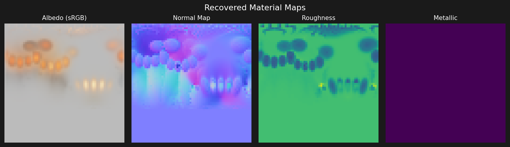

# Differentiable PBR — Inverse Material Optimisation

A **pure-PyTorch** differentiable physically-based renderer that recovers
spatially-varying material maps (albedo, normal, roughness, metallic) from
multi-view photographs by gradient descent.

No external rasterization libraries (no nvdiffrast, no pytorch3d) are needed.



**Left to right:** recovered albedo, normal map, roughness, metallic.

---

## Table of contents

1. [The inverse rendering problem](#1-the-inverse-rendering-problem)
2. [Forward rendering model](#2-forward-rendering-model)
3. [Cook-Torrance BRDF](#3-cook-torrance-brdf)
4. [Gradient flow through the renderer](#4-gradient-flow-through-the-renderer)
5. [Implementation overview](#5-implementation-overview)
6. [Quick start](#6-quick-start)
7. [Project structure](#7-project-structure)
8. [References](#8-references)

---

## 1. The inverse rendering problem

Given a set of photographs `{Iₖ}` of an object taken from known camera
poses `{Cₖ}` under known lighting `{Lⱼ}`, the inverse rendering problem is
to recover the material properties `θ` of the surface such that the
synthesised images match the observations:

```
θ* = argmin_θ Σₖ ‖R(Cₖ, {Lⱼ}, θ) − Iₖ‖²
```

where `R(·)` is the forward renderer.

This is a classic **analysis-by-synthesis** approach: we differentially
render images from our current material estimate and back-propagate the
photometric error to update the material parameters.

---

## 2. Forward rendering model

### Geometry (non-differentiable, fixed)

Rasterisation converts the 3D mesh to per-pixel geometry buffers:

| Buffer          | Shape   | Contents                               |
|-----------------|---------|----------------------------------------|
| `pixel_uv`      | (H,W,2) | surface UV coordinates                 |
| `pixel_normal`  | (H,W,3) | interpolated world-space normal        |
| `pixel_tangent` | (H,W,3) | ∂P/∂u (for TBN matrix)                |
| `pixel_bitangent`|(H,W,3) | ∂P/∂v (for TBN matrix)                |
| `pixel_pos`     | (H,W,3) | world-space position                   |
| `pixel_mask`    | (H,W)   | True where the surface was hit         |

Rasterisation itself is **not differentiable** but it only needs to run
once per view because the geometry is fixed during optimisation.

### Shading (differentiable)

At each surface fragment the outgoing radiance is:

```
L_o(x, ω_o) = Σⱼ f_r(x, ωᵢⱼ, ω_o) · Lⱼ · (n · ωᵢⱼ)⁺
```

where `ωᵢⱼ` is the direction from `x` to light `j`, and `f_r` is the
Cook-Torrance BRDF described below.

---

## 3. Cook-Torrance BRDF

The microfacet BRDF splits reflectance into diffuse and specular lobes:

```
f_r = f_diffuse + f_specular

f_diffuse  = (1 − F) · (1 − metallic) · albedo / π
f_specular = D(h) · F(v, h) · G(l, v, h) / (4 · (n·l) · (n·v))
```

### GGX normal distribution D

```
D(h) = α² / (π · ((n·h)²(α²−1) + 1)²)
```

`α = roughness²` (perceptual roughness is squared to give a more linear
artist feel, following Karis 2013).

### Schlick Fresnel F

```
F(v, h) = F₀ + (1 − F₀) · (1 − v·h)⁵
F₀      = lerp(0.04, albedo, metallic)
```

Dielectrics (metallic=0) have `F₀=0.04`; metals inherit their
characteristic tinted reflectance from the albedo channel.

### Smith height-correlated geometry G

```
G(l, v, h) = 1 / (1 + Λ(l) + Λ(v))
Λ(ω) = (−1 + √(1 + α² tan²θ)) / 2
```

This jointly accounts for shadowing (light side) and masking (view side).

---

## 4. Gradient flow through the renderer

The key insight is that **rasterisation is separated from shading**.

```
pixels ─┬─ (non-diff) rasterize ──► geometry buffers (fixed)
         │
         └─ (diff) texture sample  ──► albedo, normal, roughness, metallic
                   │
                   └─ BRDF eval ──► rendered image
                             │
                             └─ photometric loss ──► ∇θ
```

Every operation from texture sampling onward is differentiable:

| Operation            | Differentiable tool                         |
|----------------------|---------------------------------------------|
| Texture sampling     | `F.grid_sample` (bilinear)                  |
| Albedo → linear RGB  | `torch.sigmoid`                             |
| Roughness, metallic  | `torch.sigmoid`                             |
| Normal map → world   | `F.normalize` + TBN matrix multiply         |
| GGX NDF              | element-wise arithmetic, `torch.sqrt`       |
| Schlick Fresnel       | exponentiation `**5`                       |
| Smith G              | `torch.sqrt` + arithmetic                   |
| Photometric loss     | `F.mse_loss`                                |

Parameters are stored in **unconstrained logit/log space** and passed
through sigmoid/tanh at sample time, so gradients flow freely without
clamping artefacts.

---

## 5. Implementation overview

### MaterialMaps

Four learnable `nn.Parameter` tensors:

```python
self.log_albedo     # (1, 3, H, W)  → sigmoid → [0,1]³ linear RGB
self.normal_delta   # (1, 2, H, W)  → tanh    → tangent-space XY Δ
self.log_roughness  # (1, 1, H, W)  → sigmoid → [0,1]
self.log_metallic   # (1, 1, H, W)  → sigmoid → [0,1]
```

The tangent-space normal perturbation is lifted to a full unit vector and
rotated to world space with the TBN matrix:

```python
n_ts    = normalise(Δx, Δy, 1.0)
n_world = T · n_ts.x + B · n_ts.y + N · n_ts.z
```

### UV sphere with analytic TBN

The test mesh is a UV sphere parameterised by `(θ, φ)`.  Tangent and
bitangent vectors are derived analytically from `∂P/∂φ` and `∂P/∂θ`,
giving exact TBN frames without the numerical issues of finite-difference
approximations.

---

## 6. Quick start

```bash
python -m venv .venv && source .venv/bin/activate
pip install -r requirements.txt

# 1. Generate ground-truth reference images
python generate_reference.py                 # → data/reference/

# 2. Run inverse optimisation
python train.py --steps 2000                 # → results/

# 3. Visualise recovered material maps
python visualize.py                          # → results/material_maps.png
```

Works on CPU, CUDA, and Apple MPS — the device is auto-detected.

---

## 7. Project structure

```
diff-pbr/
├── pbr/
│   ├── mesh.py         — UV sphere with analytic TBN frames
│   ├── camera.py       — pinhole camera, projection matrices, lights
│   ├── rasterize.py    — numpy software rasterizer → geometry buffers
│   ├── brdf.py         — Cook-Torrance BRDF (GGX + Schlick + Smith)
│   ├── material.py     — MaterialMaps: 4 learnable log-space textures
│   └── render.py       — differentiable shading pass
├── generate_reference.py  — render ground-truth images from known material
├── train.py               — inverse optimisation loop (Adam + cosine LR)
├── visualize.py           — save recovered material map PNGs
└── requirements.txt
```

---

## 8. References

1. **Walter B., Marschner S.R., Li H., Torrance K.E.** (2007).
   "Microfacet Models for Refraction through Rough Surfaces."
   *EGSR 2007*.

2. **Karis B.** (2013).
   "Real Shading in Unreal Engine 4."
   *SIGGRAPH 2013 Course: Physically Based Shading in Theory and Practice*.

3. **Ngo T. et al.** (2021).
   "Differentiable Rendering: A Survey." *arXiv:2006.12057*.

4. **Munkberg J. et al.** (2022).
   "Extracting Triangular 3D Models, Materials, and Lighting From Images."
   *CVPR 2022*.  *(nvdiffrast paper — our implementation follows the same
   separation of rasterisation and shading.)*
